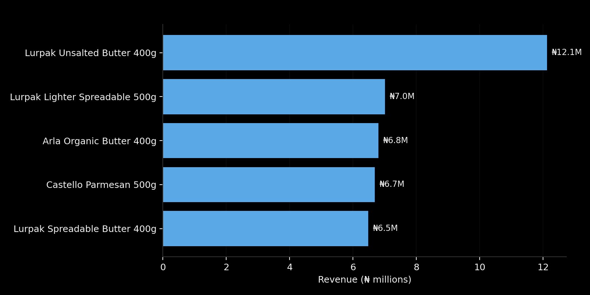
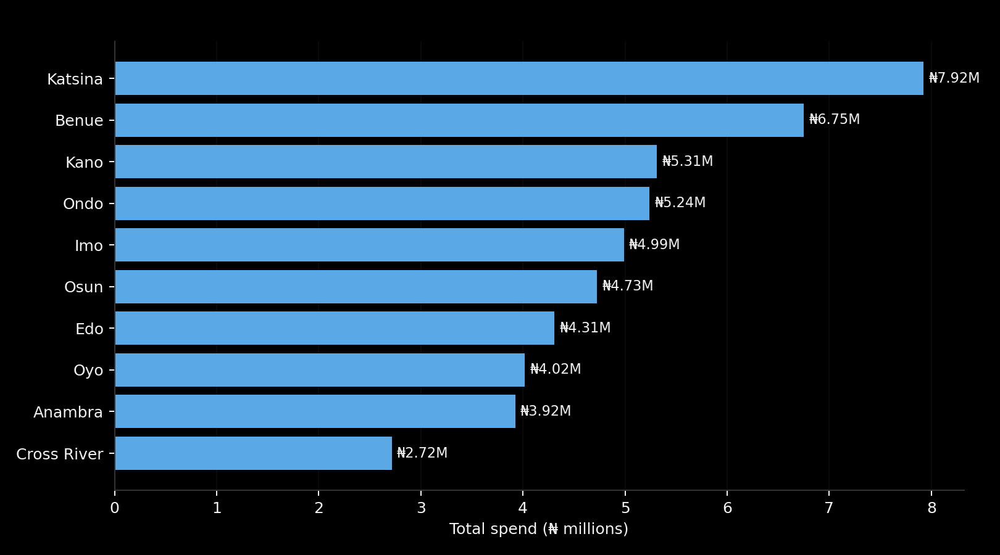

# 🥛Arla Foods Nigeria Sales Analysis — A SQL Insight

## Introduction

📊 This project started as SQL practice and turned into something I actually wanted to see through. I built a three-table database modelled on Arla Foods' brand portfolio in Nigeria — DANO, Arla, Lurpak, Castello, and Puck. I then wrote queries to answer the type of questions a commercial or trade marketing analyst at a dairy company would actually ask: which brand is carrying the quarter, which products tops the revenue and which states are topping the charts in numbers.

🔍Curious about the SQL behind this? Check the queries here: [`sql_analysis`](/sql_analysis/)

## Background

>⚠️ **NOTE:** This is a synthetic practice dataset. The brand portfolio — DANO, Arla, Lurpak, Castello, Puck reflects Arla's real lineup in Nigeria. But every customer record and every sales transaction in this database was generated for practice purposes. None of the figures below describe Arla's real business data.

I built it this way on purpose. I wanted a dataset that felt close enough to a real FMCG dairy business that the SQL questions would feel like real business questions.

## 🤔The Questions I Set Out to Answer

The full practice set has 10 questions. These covers joins, aggregation, anti-joins, and date-based grouping. Here are some few results:

1. For each quarter of 2025, what is total revenue by brand?
2. Which 5 products generated the most revenue overall?
3. Among supermarket customers only, which state spent the most?

## ⚙️Tools I Used

For this project, I worked with:

- **SQL** — the backbone of the analysis, for querying the database and pulling out the numbers that mattered.
- **PostgreSQL** — the database engine behind the whole project.
- **Visual Studio Code** — where I wrote and ran every query.
- **Git & GitHub** — for version control and to share the project here.

## 📊 The Analysis

Each query below was aimed at answering one specific business question. Here's how I approached each one, and what came out of it.

### 1️⃣ Quarterly brand revenue — the top performing in a year

```sql
SELECT
    EXTRACT(QUARTER FROM s.sale_date) AS quarter,
    p.brand,
    ROUND(
        SUM(s.quantity * s.unit_price_ngn),
        0
    ) AS total_revenue
FROM products_arla p
JOIN sales_arla s
    ON p.product_id = s.product_id
WHERE EXTRACT(YEAR FROM s.sale_date) = 2025
GROUP BY
    EXTRACT(QUARTER FROM s.sale_date),
    p.brand
ORDER BY
    quarter,
    total_revenue DESC;
```

| Quarter | Leading brand | Revenue |
|---|---|---|
| Q1 | Lurpak | ₦29.05M |
| Q2 | DANO | ₦23.29M |
| Q3 | Lurpak | ₦33.01M |
| Q4 | Lurpak | ₦28.97M |

Across the full year, brand totals came out like this:

| Brand | Total 2025 revenue | Share of total |
|---|---:|---:|
| Lurpak | ₦112.96M | 29.9% |
| Castello | ₦95.83M | 25.4% |
| DANO | ₦84.43M | 22.4% |
| Puck | ₦53.46M | 14.2% |
| Arla | ₦31.00M | 8.2% |

**What stood out to me:** Lurpak wasn't just the top brand — it won 3 of the 4 quarters outright, and Q2 was the one quarter it slipped, with DANO overtaking it by a narrow margin (₦23.29M vs ₦21.92M). Arla, meanwhile, sat consistently at the bottom every single quarter, and its Q3 number (₦5.18M) was its weakest point in the year — worth a second look at whether that's a pricing issue, a distribution gap, or just a smaller product range.

### 2️⃣ Top 5 products — where is the revenue actually concentrated?

```sql
SELECT
    p.product_id,
    p.product_name,
    ROUND(
    SUM (s.unit_price_ngn * s.quantity),
    0) AS total_revenue,
    p.brand,
    p.category
FROM
    products_arla p
JOIN sales_arla s        
    ON p.product_id = s.product_id
GROUP BY 
    p.product_id,
    p.product_name,
    p.brand,
    p.category
ORDER BY 
    total_revenue DESC
LIMIT 5;    
```


_Bar graph visualizing the top 5 products in revenue for Arla Foods Ng; Claude AI generated this graph from my SQL query results_

| Rank | Product | Brand | Category | Revenue |
|---|---|---|---|---:|
| 1 | Lurpak Unsalted Butter 400g | Lurpak | Butter | ₦12.12M |
| 2 | Lurpak Lighter Spreadable 500g | Lurpak | Butter | ₦7.01M |
| 3 | Arla Organic Butter 400g | Arla | Butter | ₦6.80M |
| 4 | Castello Parmesan 500g | Castello | Cheese | ₦6.69M |
| 5 | Lurpak Spreadable Butter 400g | Lurpak | Butter | ₦6.48M |

**What stood out to me:** Lurpak takes 3 of the top 5 spots, which lines up with it being the year's overall revenue brand. Plus, every single product in this top 5 is either Butter or Cheese. That's a strong signal that in this dataset, the premium, higher-margin categories are where the real revenue concentration sits — worth testing against unit_cost_ngn in a follow-up query on margin.

### 3️⃣ Top states by supermarket spend

```sql
SELECT
    c.state,
    ROUND(
    SUM(s.unit_price_ngn * s.quantity),
     0
     ) AS total_spend
FROM
    customers_arla c   
JOIN  sales_arla s           
    ON c.customer_id = s.customer_id
WHERE customer_type = 'Supermarket'
GROUP BY c.state
ORDER BY total_spend DESC;
```


_Bar chart showing the highest spending states among supermarket customers; Claude AI generated this graph from my SQL query results_

| Rank | State | Spend |
|---|---|---:|
| 1 | Katsina | ₦7.92M |
| 2 | Benue | ₦6.75M |
| 3 | Kano | ₦5.31M |
| 4 | Ondo | ₦5.24M |
| 5 | Imo | ₦4.99M |
| 6 | Osun | ₦4.73M |
| 7 | Edo | ₦4.31M |
| 8 | Oyo | ₦4.02M |
| 9 | Anambra | ₦3.92M |
| 10 | Cross River | ₦2.72M |

**What stood out to me:** Katsina came out on top with ₦7.92M, just under 13% of all supermarket spend across the 17 states that showed up in the results. **(I guess it should have been Lagos you know :-) not too surprised because the dataset wasn't a real business data but a random generated data for educational purpose, so in a real-world market intuition that assumption can't hold...**

## 📚 What I Learned

Working through this project pushed my SQL further than the basic `SELECT/WHERE` level:

- 🧩 **Joining across a real schema** — building queries that walk from a fact table (`sales_arla`) out to two dimension tables (`products_arla`, `customers_arla`), and getting comfortable with which table to anchor the `FROM` on.
- 🧮 **Computed expressions inside aggregates** — writing `SUM(quantity * unit_price_ngn * (1 - discount_pct/100))` instead of assuming a revenue column already exists, and catching the difference between list price and what a customer actually paid.
- 🗓️ **Date-based grouping** — using `EXTRACT(QUARTER FROM sale_date)` to roll transactions up into business periods instead of just raw dates.
- 🎯 **Filtering before grouping vs. after** — the difference between a `WHERE` clause (filters rows before aggregation, like restricting to Supermarket customers) and a `HAVING` clause (filters after aggregation, like keeping only products above a revenue threshold).
- 🚫 **Anti-join logic** — writing queries for "customers who have never bought X," which needed a different mental model than a standard JOIN.

## ⬇️Conclusions

A few things came out of this analysis worth sitting with:

- **Lurpak is toptier** — leading 3 of 4 quarters and taking 3 of the top 5 product slots. If this were a real business, that's a brand you'd want to understand deeply: what's driving it, and whether it's replicable elsewhere in the portfolio.
- **Butter and Cheese outperform Milk Powder, UHT, and Yoghurt at the top end** — none of the latter categories cracked the top 5 products, despite having more SKUs in the catalogue overall.

## Closing Thoughts

This project sharpened two things for me at once: my SQL, and my instinct for asking business-shaped questions of a dataset rather than just technically correct ones. Every query here started from something I'd genuinely want to know if I were sitting inside a dairy company's commercial team, and not just "can I write this JOIN," but "what would this number actually tell someone making a decision." That's the habit I wanted to build!
